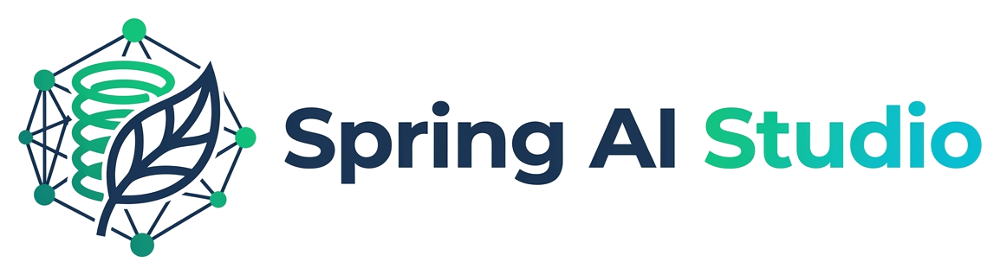
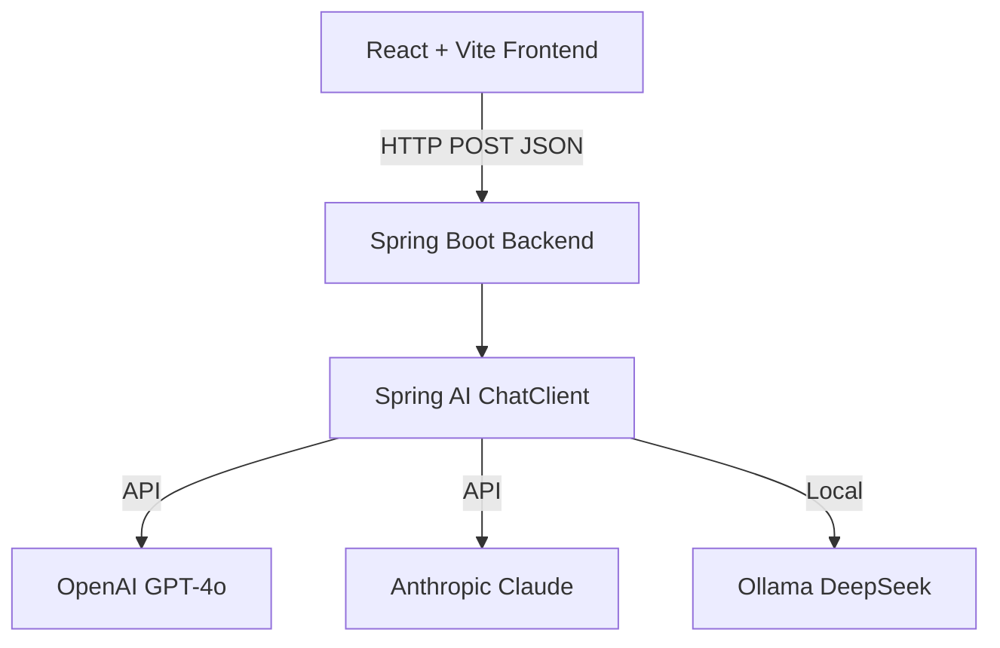

<p align="center">
  
</p>

<h1 align="center">Spring AI Studio</h1>

<p align="center">
  <strong>A professional LLM Comparison Workspace built with Spring Boot, Spring AI, and React.</strong><br>
  Compare and evaluate multiple Large Language Models side-by-side using the same prompt.
</p>

<p align="center">
  <a href="https://dev.java/"></a>
  <a href="https://spring.io/projects/spring-boot"></a>
  <a href="https://spring.io/projects/spring-ai"></a>
  <a href="https://react.dev/"></a>
  <a href="https://vitejs.dev/"></a>
</p>

---

## ✨ Features
- **Side-by-Side Comparison**: Submit a single prompt and watch OpenAI, Anthropic, and Ollama respond simultaneously.
- **Performance Benchmarking**: Automatically tracks response times and highlights the fastest model.
- **Provider Support**: Seamlessly switch between Cloud APIs (OpenAI, Claude) and Local Models (DeepSeek via Ollama).
- **Graceful Error Handling**: Intelligently catches missing API keys or offline local models with a polished UI rather than crashing.
- **Dark & Light Mode**: Native theme toggling saved via `localStorage`.

---

## 🏗️ Architecture



---

## 📂 Project Structure

```text
Spring-AI-Studio/
├── Backend/                 # Spring Boot Application
│   ├── src/main/java/       # Java source files (Controllers, Configurations)
│   ├── src/main/resources/  # application.properties & environment configs
│   └── pom.xml              # Maven dependencies
├── Frontend/                # React Application
│   ├── src/                 # React components (App.jsx) and assets
│   ├── public/              # Static assets (branding/spring-ai-studio-logo.png, favicon.png)
│   ├── package.json         # Node dependencies
│   └── .env.example         # Frontend environment configuration
└── README.md
```

---

## ⚙️ Prerequisites

1. **Java 21** or higher
2. **Node.js** (v18+)
3. **Maven** (optional, wrapper included)
4. **Ollama** installed locally (if testing local models like DeepSeek)
5. Provider API Keys (OpenAI / Anthropic)

---

## 🔐 Environment Configuration

### Backend Setup
In `Backend/src/main/resources/application.properties` or via system environment variables, configure your keys:
```properties
SPRING_AI_OPENAI_API_KEY=your-openai-api-key
SPRING_AI_ANTHROPIC_API_KEY=your-anthropic-api-key
```

### Frontend Setup
In `Frontend/.env`:
```env
# Point this to your backend server URL
VITE_API_BASE_URL=http://localhost:8080
```

---

## ▶️ How to Run Locally

### 1. Start the Backend
```bash
cd "Backend"
mvn clean compile
mvn spring-boot:run
```
*The Spring Boot server will start on port `8080`.*

### 2. Start the Frontend
```bash
cd "Frontend"
npm install
npm run dev
```
*The Vite dev server will start on port `5173`. Open `http://localhost:5173` in your browser.*

---

## ☁️ Deploy Frontend to Vercel

The React frontend is optimized for deployment on Vercel.

1. **Push your repository** to GitHub.
2. **Import the project** into Vercel.
3. Select the `Frontend` directory as the **Root Directory**.
4. Set the **Build Command** to `npm run build` and **Output Directory** to `dist`.
5. **Environment Variables**: Add `VITE_API_BASE_URL` pointing to your deployed Spring Boot backend URL.
6. Click **Deploy**.

> **Note**: Vercel hosts the React frontend. The Spring Boot backend must be deployed separately to a Java-compatible hosting environment (e.g., AWS Elastic Beanstalk, Heroku, Railway).

---

## 🔗 API Endpoints

The backend exposes stateless endpoints consuming JSON payloads.
- `POST /api/openai/ask`
- `POST /api/anthropic/ask`
- `POST /api/ollama/ask`

**Payload Format:**
```json
{
  "prompt": "Explain Spring Boot dependency injection"
}
```

---

## 📝 License
This project is open-source. Feel free to use, modify, and distribute.
